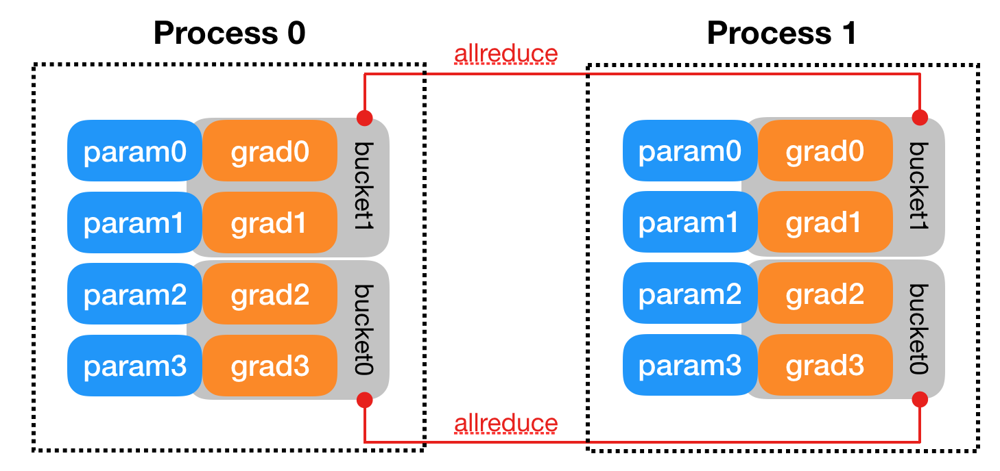
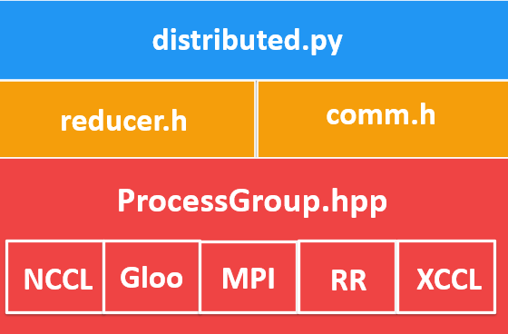

# Distributed Data Parallel
分布式数据并行

* https://docs.pytorch.org/docs/2.13/notes/ddp.html

Created On: May 16, 2026 | Last Updated On: May 16, 2026
创建日期: 2026年5月16日 | 最后更新日期: 2026年5月16日

> Warning
> The implementation of [`torch.nn.parallel.DistributedDataParallel`](https://docs.pytorch.org/docs/2.13/generated/torch.nn.parallel.DistributedDataParallel.html#torch.nn.parallel.DistributedDataParallel "torch.nn.parallel.DistributedDataParallel") evolves over time. This design note is written based on the state as of v1.4.
> [torch.nn.parallel.DistributedDataParallel]() 的实现会随时间演变. 本设计说明基于 v1.4 版本的状态编写.
>

[torch.nn.parallel.DistributedDataParallel](https://docs.pytorch.org/docs/2.13/generated/torch.nn.parallel.DistributedDataParallel.html#torch.nn.parallel.DistributedDataParallel "torch.nn.parallel.DistributedDataParallel") (DDP) transparently performs distributed data parallel training. This page describes how it works and reveals implementation details.
[torch.nn.parallel.DistributedDataParallel]() (DDP) 透明地执行分布式数据并行训练. 本页面将介绍其工作原理并揭示实现细节.

## Example

Let us start with a simple [`torch.nn.parallel.DistributedDataParallel`](https://docs.pytorch.org/docs/2.13/generated/torch.nn.parallel.DistributedDataParallel.html#torch.nn.parallel.DistributedDataParallel "torch.nn.parallel.DistributedDataParallel") example. This example uses a [`torch.nn.Linear`](https://docs.pytorch.org/docs/2.13/generated/torch.nn.Linear.html#torch.nn.Linear "torch.nn.Linear") as the local model, wraps it with DDP, and then runs one forward pass, one backward pass, and an optimizer step on the DDP model. After that, parameters on the local model will be updated, and all models on different processes should be exactly the same.
让我们从一个简单的 [torch.nn.parallel.DistributedDataParallel]() 开始. 例如, 本示例使用 [torch.nn.Linear]() 作为本地模型, 并用 DDP 对其进行封装, 然后对 DDP 模型运行一次前向传播、一次反向传播和一个优化步骤. 之后, 本地模型的参数将被更新, 所有不同进程上的模型应该完全相同.

```python
import torch
import torch.distributed as dist
import torch.multiprocessing as mp
import torch.nn as nn
import torch.optim as optim
import os
from torch.nn.parallel import DistributedDataParallel as DDP


def example(rank, world_size):
    # create default process group
    dist.init_process_group("gloo", rank=rank, world_size=world_size)
    # create local model
    model = nn.Linear(10, 10).to(rank)
    # construct DDP model
    ddp_model = DDP(model, device_ids=[rank])
    # define loss function and optimizer
    loss_fn = nn.MSELoss()
    optimizer = optim.SGD(ddp_model.parameters(), lr=0.001)

    # forward pass
    outputs = ddp_model(torch.randn(20, 10).to(rank))
    labels = torch.randn(20, 10).to(rank)
    # backward pass
    loss_fn(outputs, labels).backward()
    # update parameters
    optimizer.step()

def main():
    world_size = 2
    mp.spawn(example,
        args=(world_size,),
        nprocs=world_size,
        join=True)

if __name__=="__main__":
    # Environment variables which need to be
    # set when using c10d's default "env"
    # initialization mode.
    os.environ["MASTER_ADDR"] = "localhost"
    os.environ["MASTER_PORT"] = "29500"
    main()
```

DDP works with TorchDynamo. When used with TorchDynamo, apply the DDP model wrapper before compiling the model, such that torchdynamo can apply `DDPOptimizer` (graph-break optimizations) based on DDP bucket sizes. (See [TorchDynamo DDPOptimizer](https://docs.pytorch.org/docs/2.13/notes/ddp.html#torchdynamo-ddpoptimizer) for more information.)
DDP 可与 TorchDynamo 配合使用. 与 TorchDynamo 一起使用时, 请在编译模型之前应用 DDP 模型包装器, 以便 TorchDynamo 可以应用 `DDPOptimizer` 基于 DDP 桶大小的(图断裂优化). (更多信息请参阅 [TorchDynamo DDPOptimizer]().)

```python
ddp_model = DDP(model, device_ids=[rank])
ddp_model = torch.compile(ddp_model)
```

## Internal Design
内部设计

This section reveals how it works under the hood of [`torch.nn.parallel.DistributedDataParallel`](https://docs.pytorch.org/docs/2.13/generated/torch.nn.parallel.DistributedDataParallel.html#torch.nn.parallel.DistributedDataParallel "torch.nn.parallel.DistributedDataParallel") by diving into details of every step in one iteration.
本节揭示其底层工作原理. [torch.nn.parallel.DistributedDataParallel]() 通过深入了解一次迭代中的每一步的细节.

- **Prerequisite**: DDP relies on c10d `ProcessGroup` for communications. Hence, applications must create `ProcessGroup` instances before constructing DDP.
  前提条件: DDP 依赖于 c10d `ProcessGroup` 进行通信. 因此, 应用程序必须先创建 `ProcessGroup` 实例, 然后才能构建 DDP.

- **Construction**: The DDP constructor takes a reference to the local module, and broadcasts `state_dict()` from the process with rank 0 to all other processes in the group to make sure that all model replicas start from the exact same state. Then, each DDP process creates a local `Reducer`, which later will take care of the gradients synchronization during the backward pass. To improve communication efficiency, the `Reducer` organizes parameter gradients into buckets, and reduces one bucket at a time. Bucket size can be configured by setting the `bucket_cap_mb` argument in DDP constructor. The mapping from parameter gradients to buckets is determined at the construction time, based on the bucket size limit and parameter sizes. Model parameters are allocated into buckets in (roughly) the reverse order of `Model.parameters()` from the given model. The reason for using the reverse order is because DDP expects gradients to become ready during the backward pass in approximately that order. The figure below shows an example. Note that, the `grad0` and `grad1` are in `bucket1`, and the other two gradients are in `bucket0`. Of course, this assumption might not always be true, and when that happens it could hurt DDP backward speed as the `Reducer` cannot kick off the communication at the earliest possible time. Besides bucketing, the `Reducer` also registers autograd hooks during construction, one hook per parameter. These hooks will be triggered during the backward pass when the gradient becomes ready.
  构造: DDP 构造函数接受一个指向本地模块的引用, 并将 rank 为 0 的进程的 `state_dict()` 广播到组内的所有其他进程, 以确保所有模型副本都从完全相同的状态开始. 然后, 每个 DDP 进程创建一个本地 `Reducer`, 该 Reducer 将在反向传播过程中负责梯度同步. 为了提高通信效率, `Reducer` 将参数梯度组织成桶, 并一次处理一个桶. 桶的大小可以通过在 DDP 构造函数中设置 `bucket_cap_mb` 参数来配置. 参数梯度到桶的映射关系在构造过程中确定. 时间取决于桶大小限制和参数大小. 模型参数为: 按(大致)相反的顺序分配到各个桶中从给定模型中 `Model.parameters()`. 之所以使用反向顺序, 是因为 DDP 期望梯度在反向传播过程中大致按此顺序准备就绪. 下图展示了一个示例. 请注意, `grad0` 和 `grad1` 位于 `bucket1` 中, 而其他两个梯度位于 `bucket0` 中. 当然, 这种假设并非总是成立. 如果属实, 那么当这种情况发生时, 可能会影响 DDP 的后退速度. `Reducer` 无法在最早的时间点启动通信. 除了分桶之外, `Reducer` 还在构建过程中注册了自动梯度钩子, 每个参数对应一个钩子. 这些钩子会在反向传播过程中梯度准备就绪时触发.

- **Forward Pass**: The DDP takes the input and passes it to the local model, and then analyzes the output from the local model if `find_unused_parameters` is set to `True`. This mode allows running backward on a subgraph of the model, and DDP finds out which parameters are involved in the backward pass by traversing the autograd graph from the model output and marking all unused parameters as ready for reduction. During the backward pass, the `Reducer` would only wait for unready parameters, but it would still reduce all buckets. Marking a parameter gradient as ready does not help DDP skip buckets as for now, but it will prevent DDP from waiting for absent gradients forever during the backward pass. Note that traversing the autograd graph introduces extra overheads, so applications should only set `find_unused_parameters` to `True` when necessary.
  前向传递: DDP 接收输入并将其传递给本地模型, 然后分析本地模型的输出结果(如果适用). `find_unused_parameters` 设置为 `True`. 此模式允许在模型的子图上运行反向传播, DDP 通过遍历模型输出的自微分图, 并将所有未使用的参数标记为准备归约, 从而确定哪些参数参与反向传播. 在反向传播期间, `Reducer` 只会等待未准备就绪的参数, 但它仍然会减少所有桶. 将参数梯度标记为就绪并不会…… 目前, DDP 可以跳过某些桶, 但这会阻止 DDP 等待. 在反向传播过程中, 梯度始终不存在. 请注意, 遍历自动微分图会引入额外的开销, 因此应用程序应该只设置它. 必要时将 `find_unused_parameters` 设置为 `True`.

- **Backward Pass**: The `backward()` function is directly invoked on the loss `Tensor`, which is out of DDP's control, and DDP uses autograd hooks registered at construction time to trigger gradients synchronizations. When one gradient becomes ready, its corresponding DDP hook on that grad accumulator will fire, and DDP will then mark that parameter gradient as ready for reduction. When gradients in one bucket are all ready, the `Reducer` kicks off an asynchronous `allreduce` on that bucket to calculate mean of gradients across all processes. When all buckets are ready, the `Reducer` will block waiting for all `allreduce` operations to finish. When this is done, averaged gradients are written to the `param.grad` field of all parameters. So after the backward pass, the `grad` field on the same corresponding parameter across different DDP processes should be the same.
  反向传播: 直接对损失函数调用 `backward()` 函数. `Tensor` 不受 DDP 控制, 而 DDP 使用了自动微分钩子. 在构建时注册以触发梯度同步. 当一个渐变准备就绪后, 其对应的 DDP 钩子就会连接到该渐变上. 累加器将触发, 然后 DDP 会将该参数梯度标记为准备进行稀释. 当一个桶中的梯度都准备就绪时, `Reducer` 会对该桶发起异步 `allreduce`, 以计算所有进程梯度的平均值. 当所有桶都准备就绪后, `Reducer` 将阻塞, 等待所有 `allreduce` 操作完成. 完成后, 平均梯度将被写入所有参数的 `param.grad` 字段. 因此, 在反向传播之后, 不同 DDP 进程中同一对应参数的 `grad` 字段值应该相同.

- **Optimizer Step**: From the optimizer's perspective, it is optimizing a local model. Model replicas on all DDP processes can keep in sync because they all start from the same state and they have the same averaged gradients in every iteration.
  优化器步骤: 从优化器的角度来看, 它是在优化一个局部模型. 所有 DDP 进程上的模型副本可以保持同步, 因为它们都从相同的状态开始, 并且在每次迭代中都具有相同的平均梯度.



> Note
> DDP requires `Reducer` instances on all processes to invoke `allreduce` in exactly the same order, which is done by always running `allreduce` in the bucket index order instead of actual bucket ready order. Mismatched `allreduce` order across processes can lead to wrong results or DDP backward hang.
> DDP 要求所有进程上的 `Reducer` 实例都要调用 `allreduce` 顺序必须完全相同, 这是通过始终运行 `allreduce` 来实现的. 按存储桶索引顺序而非实际存储桶就绪顺序排列. 不匹配. 跨进程 `allreduce` 顺序可能会导致错误的结果或 DDP 向后挂起.
>

## Implementation
执行

Below are pointers to the DDP implementation components. The stacked graph shows the structure of the code.
以下是 DDP 实现组件的链接. 堆叠图显示了代码结构.

### ProcessGroup
进程组

- [ProcessGroup.hpp](https://github.com/pytorch/pytorch/blob/v1.7.0/torch/lib/c10d/ProcessGroup.hpp): contains the abstract API of all process group implementations. The `c10d` library provides 3 implementations out of the box, namely, `ProcessGroupGloo`, `ProcessGroupNCCL`, and `ProcessGroupMPI`. `DistributedDataParallel` uses `ProcessGroup::broadcast()` to send model states from the process with rank 0 to others during initialization and `ProcessGroup::allreduce()` to sum gradients.
  [ProcessGroup.hpp](): 包含所有 `c10d` 组实现的抽象 API. c10d 该库提供了 3 种开箱即用的实现方式, 分别是: `ProcessGroupGloo`、`ProcessGroupNCCL` 和 `ProcessGroupMPI`. `DistributedDataParallel` 使用 `ProcessGroup::broadcast()` 在初始化期间将 rank 为 0 的进程的模型状态发送到其他进程, 并 `ProcessGroup::allreduce()` 来求和梯度.

- [Store.hpp](https://github.com/pytorch/pytorch/blob/v1.7.0/torch/lib/c10d/Store.hpp): assists the rendezvous service for process group instances to find each other.
  [Store.hpp](): 协助进程组实例的会合服务相互查找.


### DistributedDataParallel
分布式数据并行

- [distributed.py](https://github.com/pytorch/pytorch/blob/v1.7.0/torch/nn/parallel/distributed.py): is the Python entry point for DDP. It implements the initialization steps and the `forward` function for the `nn.parallel.DistributedDataParallel` module which call into C++ libraries. Its `_sync_param` function performs intra-process parameter synchronization when one DDP process works on multiple devices, and it also broadcasts model buffers from the process with rank 0 to all other processes. The inter-process parameter synchronization happens in `Reducer.cpp`.
  [distributed.py](): 是 DDP 的 Python 入口点. 它实现了 `nn.parallel.DistributedDataParallel` 的初始化步骤和 `forward` 传播函数. 调用 C++ 库的模块. 它的 `_sync_param` 函数执行当一个 DDP 进程处理多个进程时, 进程内参数同步设备, 并且它还会将来自 rank 0 进程的模型缓冲区广播到所有其他进程. 进程间参数同步发生在…… `Reducer.cpp`.

- [comm.h](https://github.com/pytorch/pytorch/blob/v1.7.0/torch/csrc/distributed/c10d/comm.h): implements the coalesced broadcast helper function which is invoked to broadcast model states during initialization and synchronize model buffers before the forward pass.
  [comm.h](): 实现了合并广播辅助函数, 该函数在初始化期间被调用以广播模型状态, 并在前向传播之前同步模型缓冲区.

- [reducer.h](https://github.com/pytorch/pytorch/blob/v1.7.0/torch/csrc/distributed/c10d/reducer.h): provides the core implementation for gradient synchronization in the backward pass. It has three entry point functions:
  [reducer.h](): 提供了反向传播过程中梯度同步的核心实现. 它有三个入口函数:

  - `Reducer`: The constructor is called in `distributed.py` which registers `Reducer::autograd_hook()` to gradient accumulators.
    `Reducer`: 构造函数在 `distributed.py` 中调用, 该文件会进行注册. `Reducer::autograd_hook()` 到梯度累加器.

  - `autograd_hook()` function will be invoked by the autograd engine when a gradient becomes ready.
    当梯度准备就绪时, 自动微分引擎将调用 `autograd_hook()` 函数.

  - `prepare_for_backward()` is called at the end of DDP forward pass in `distributed.py`. It traverses the autograd graph to find unused parameters when `find_unused_parameters` is set to `True` in DDP constructor.
    `prepare_for_backward()` 函数在 DDP 前向传递结束时被调用. `distributed.py`. 当 DDP 构造函数中的 `find_unused_parameters` 设置为 `True` 时, 它​​会遍历自动微分图以查找未使用的参数.



### TorchDynamo DDPOptimizer
TorchDynamo DDP 优化器

DDP's performance advantage comes from overlapping allreduce collectives with computations during backwards. AotAutograd prevents this overlap when used with TorchDynamo for compiling a whole forward and whole backward graph, because allreduce ops are launched by autograd hooks *after* the whole optimized backwards computation finishes.
DDP 的性能优势源于在反向推导过程中, allreduce 操作与计算重叠. 当与 TorchDynamo 一起使用编译整个正向和反向推导图时, AotAutograd 会阻止这种重叠, 因为 allreduce 操作是由 autograd 钩子在所有优化后的反向推导计算完成后才启动的.

TorchDynamo's DDPOptimizer helps by breaking the forward graph at the logical boundaries of DDP's allreduce buckets during backwards. Note: the goal is to break the graph during backwards, and the simplest implementation is to break the forward graphs and then call AotAutograd and compilation on each section. This allows DDP's allreduce hooks to fire in-between sections of backwards, and schedule communications to overlap with compute.
TorchDynamo 的 DDPOptimizer 通过在反向执行期间, 于 DDP 的 allreduce 桶的逻辑边界处打破正向图来发挥作用. 注意: 目标是在反向执行期间打破图, 最简单的实现方法是打破正向图, 然后对每个部分调用 AotAutograd 并进行编译. 这使得 DDP 的 allreduce 钩子可以在反向执行的各个部分之间触发, 并安排通信与计算重叠.

See [this blog post](https://dev-discuss.pytorch.org/t/torchdynamo-update-9-making-ddp-work-with-torchdynamo/860/1) for a more in-depth explanation and experimental results, or read the docs and code at [torch/_dynamo/optimizations/distributed.py](https://github.com/pytorch/pytorch/blob/bbc39b7bb48d28d67e3253a89cc82df3687ddd1b/torch/_dynamo/backends/distributed.py#L124)
请参阅[这篇博客文章]() 更深入的解释和实验结果, 或阅读文档和代码, 请访问: [torch/_dynamo/optimizations/distributed.py]()

To Debug DDPOptimizer, set `TORCH_LOGS='ddp_graphs'` for full graph dumps. For logs without graphs, add any of 'dynamo', 'distributed', or 'dist_ddp' to `TORCH_LOGS` (for basic info about bucket boundaries). To disable DDPOptimizer, set `torch._dynamo.config.optimize_ddp=False`. DDP and TorchDynamo should still work correctly without DDPOptimizer, but with performance degradation.
要调试 DDPOptimizer, 请将 `TORCH_LOGS='ddp_graphs'` 以生成完整的图形转储. 对于不包含图形的日志, 请将 'dynamo'、'distributed' 或 'dist_ddp' 中的任意一个添加到 `TORCH_LOGS` 中. (有关存储桶边界的基本信息). 要禁用 DDPOptimizer, 请设置 `torch._dynamo.config.optimize_ddp=False`. 禁用 DDPOptimizer 后, DDP 和 TorchDynamo 仍能正常工作, 但性能会有所下降.
